
<h1 align="center">健身房管理系统</h1>

## 简介
健身房管理系统：基于Spring Boot开发，支持管理员和用户角色；功能包括教练预约、课程管理、用户管理、健身论坛和会员注册等，界面简洁直观，便于用户操作和管理。    --计算机毕业设计源码；毕设源码；java毕业设计源码

## 联系方式

<h3 align="center">获取完整代码与数据库文件 + 微信：deepguan QQ: 86050149 QQ群: 783742310</h3>

<h3 align="center">可帮忙远程部署 包运行成功！提供远程部署、修改代码、设计文档指导、代码讲解等服务！</h3>

## 功能介绍（完整见运行截图）
管理员：基本功能包括系统登录、注册和用户管理，提供个人中心以维护管理员信息。网站首页设有主导航栏，实现课程预约管理、会员管理、教练管理和健身课程管理等功能。支持课程和会员数据的维护与更新，对用户和教练预约进行审批和反馈处理。管理员可查看详细信息、删除记录、管理课程留言，确保系统各模块高效运作。

用户：基本功能涵盖登录、注册和个人信息管理，允许通过个人中心查看和修改个人信息。用户可浏览网站首页各模块，包括健身课程、教练信息，以及进行课程预约申请和留言管理。用户可在健身论坛参与讨论，收藏健身课程，并申请预约教练。搜索功能用于筛选教练，帮助用户根据需求选择适合的课程与教练。整个设计简洁，方便用户操作。

教练：功能包括个人信息展示和预约管理，用户可以浏览教练主页，查看课程安排。教练负责更新个人信息、维护课程安排，接收处理来自用户的预约申请。教练可通过系统与用户互动，回应课程留言，确保高质量的健身课程和教学服务，为用户提供专业指导。

注册用户：具备注册登录基本功能，通过用户中心管理个人课程留言和预约申请。注册用户可查看课程列表、教练信息，并利用用户体验功能如“详情查看”、“删除”等操作管理个人数据。系统提供直观的交互界面，简化信息访问和操作步骤，为用户提供便利的操作体验。

## 运行截图

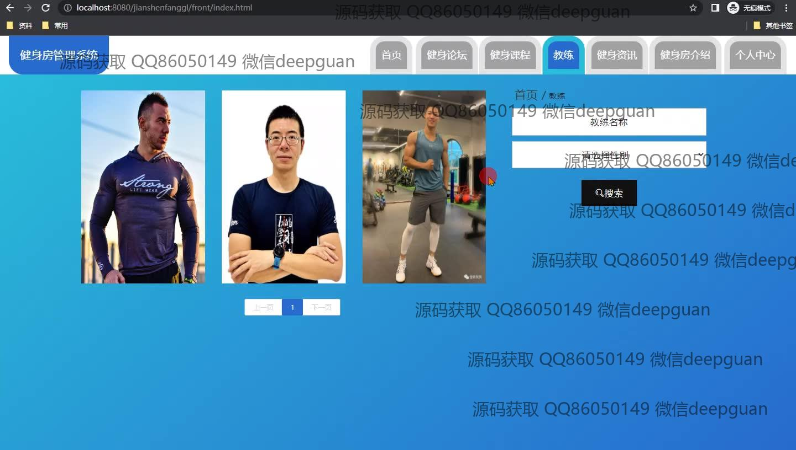

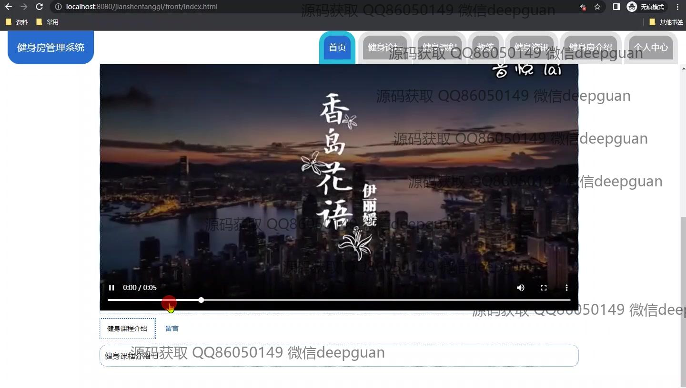
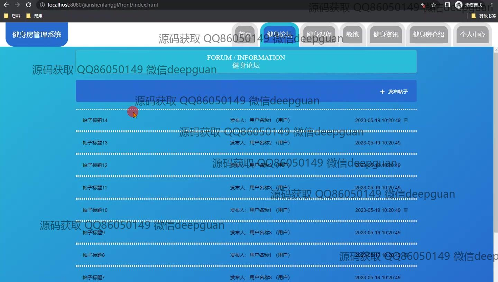
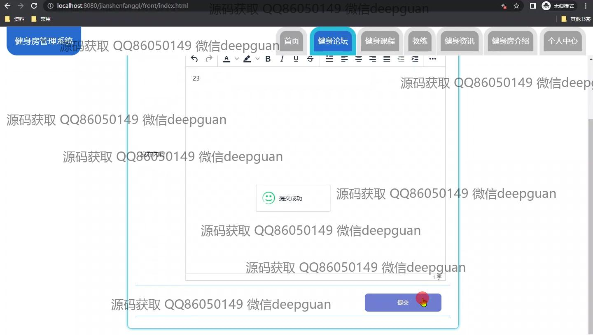

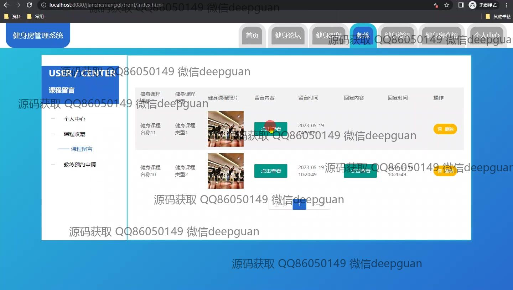
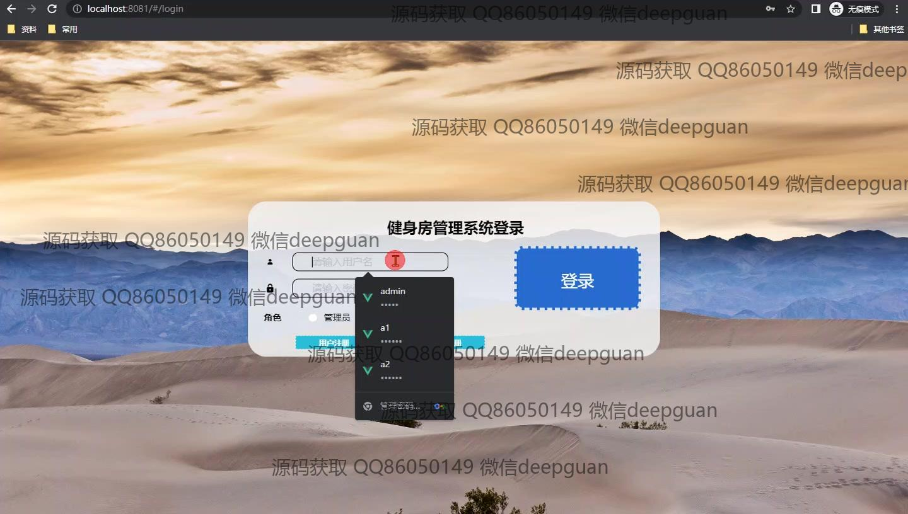
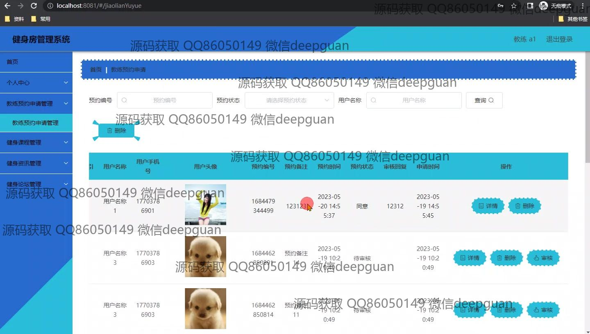
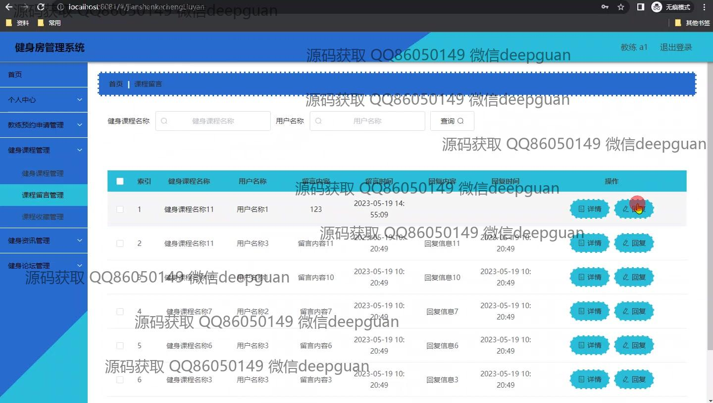
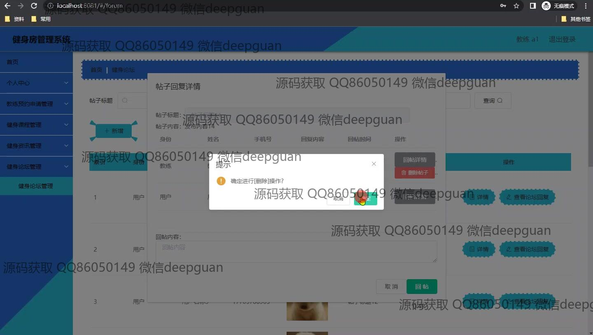
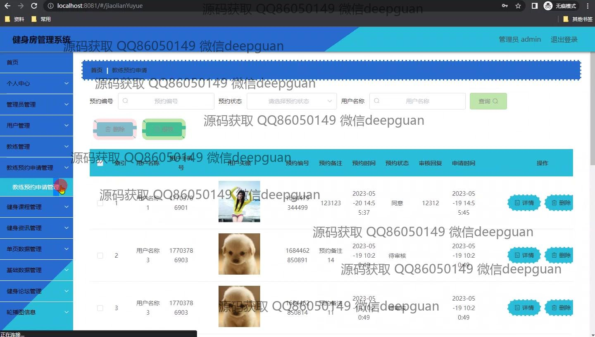
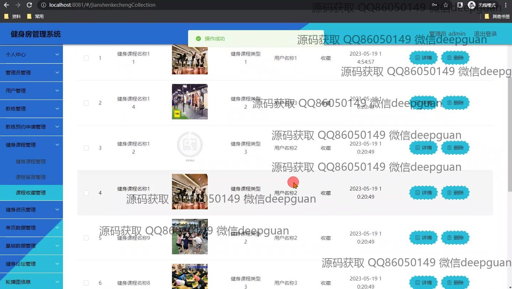
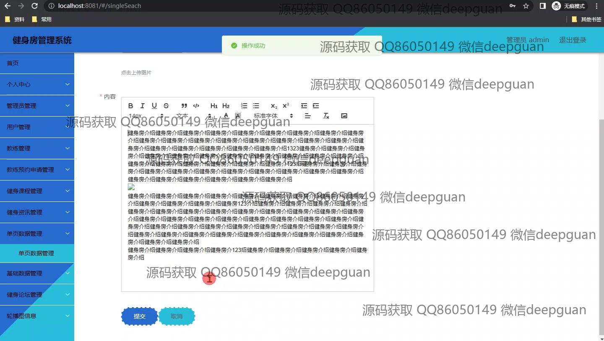
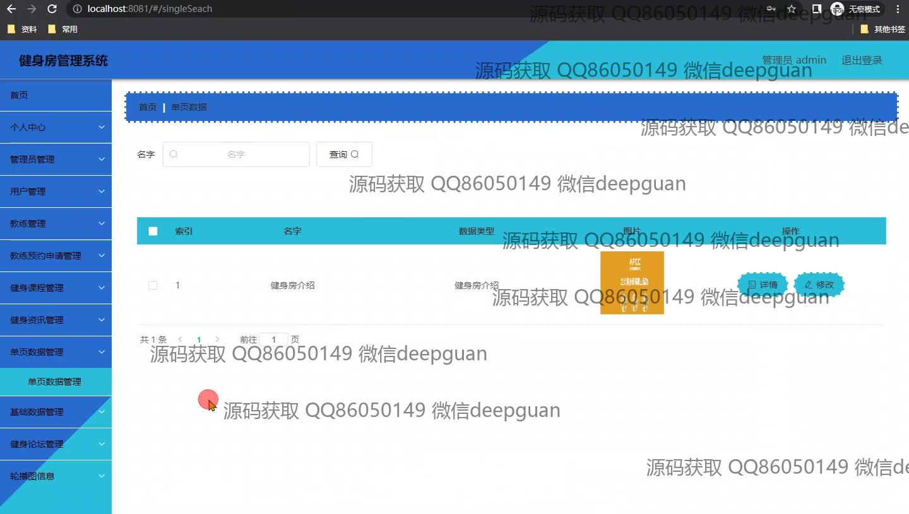
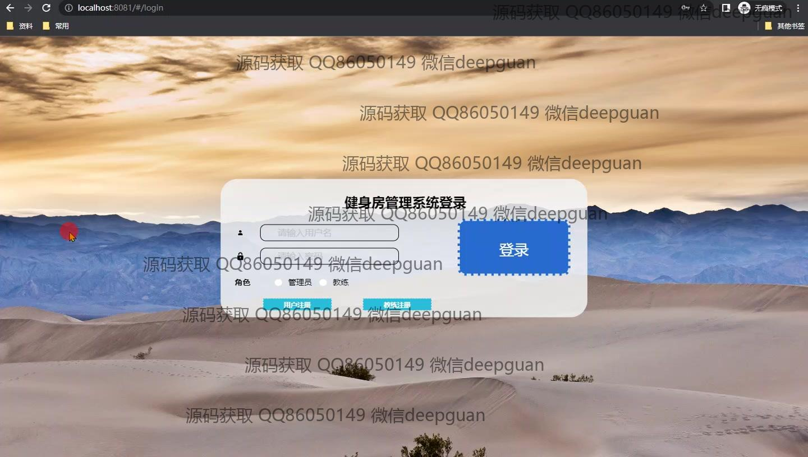

本代码来源于网络,仅供学习参考使用!

